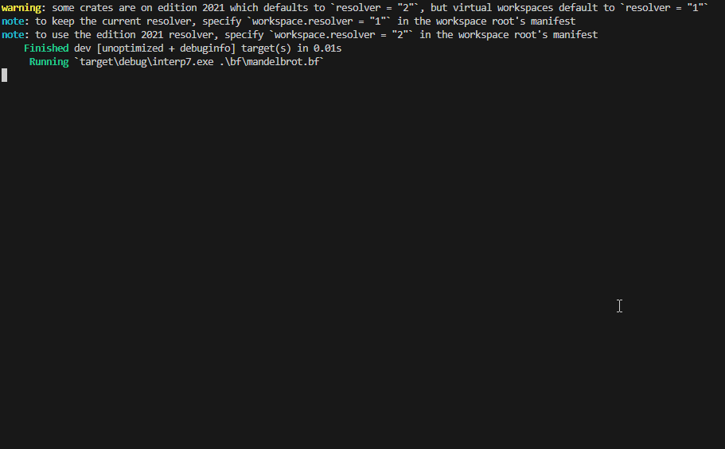

## BF Programming Language Interpreter 🖥️

A fully exhaustive interpreter for BF, an esoteric programming language, implemented in Rust. This interpreter comes with various optimizations, including zero optimization, caching, and instruction consolidation.



### Getting Started 📦

To use the interpreter, you can build the project with Rust's package manager, Cargo.

```bash
cargo build --release
```

This will generate the executable in the `target/release` directory. You can then run your BF code by providing the path to your BF source file as a command-line argument. All of the BF source files are found in the bf folder.

```bash
cargo run --bin interp(1-7) bf/hello.bf
```

### Description of Each BF Implementation 🚗

- **interp1**: The basic BF interpreter.
- **interp2**: The basic BF interpreter with bracket caching.
- **interp3**: A BF interpreter with opcodes and bracket caching.
- **interp4**: A BF interpreter with opcodes and inline bracket caching.
- **interp5**: A BF interpreter with opcodes, inline bracket caching, and Add optimization.
- **interp6**: A BF interpreter with opcodes, inline bracket caching, and Add/Sub/Left/Right optimizations.
- **interp7**: A BF interpreter with opcodes, inline bracket caching, Add/Sub/Left/Right optimizations, and Zero optimization.

### Usage

Execute the program with the path to your BF source file as a command-line argument.

The interpreter will execute the BF code and produce the output accordingly.

**Note**: The performance improvement percentages are based on internal benchmarks and may vary depending on the nature of the BF code being executed.